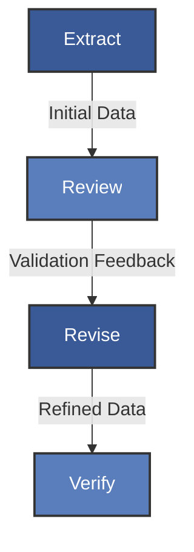
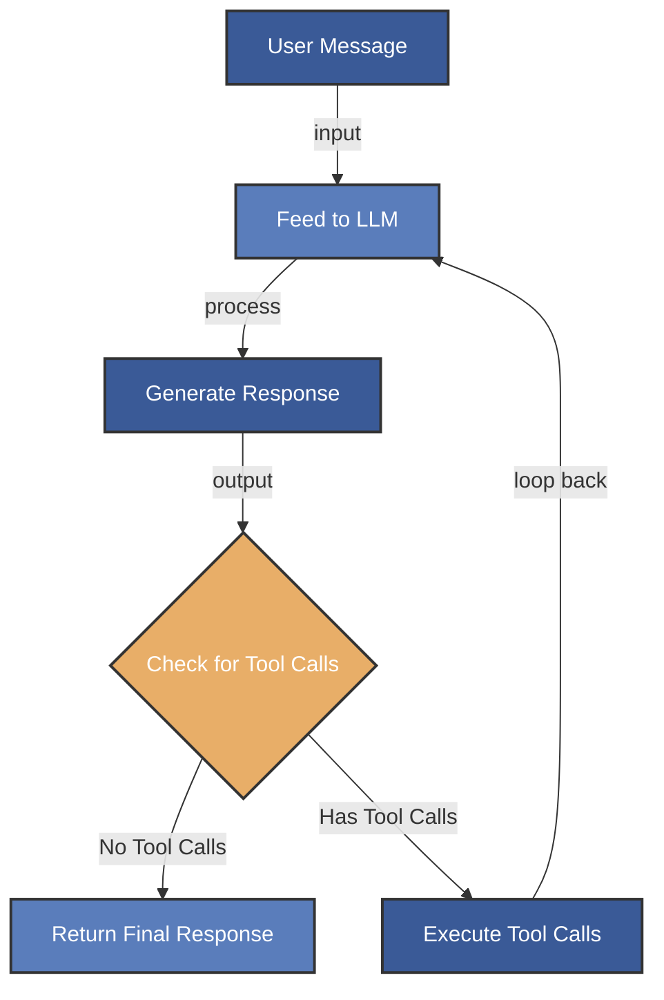
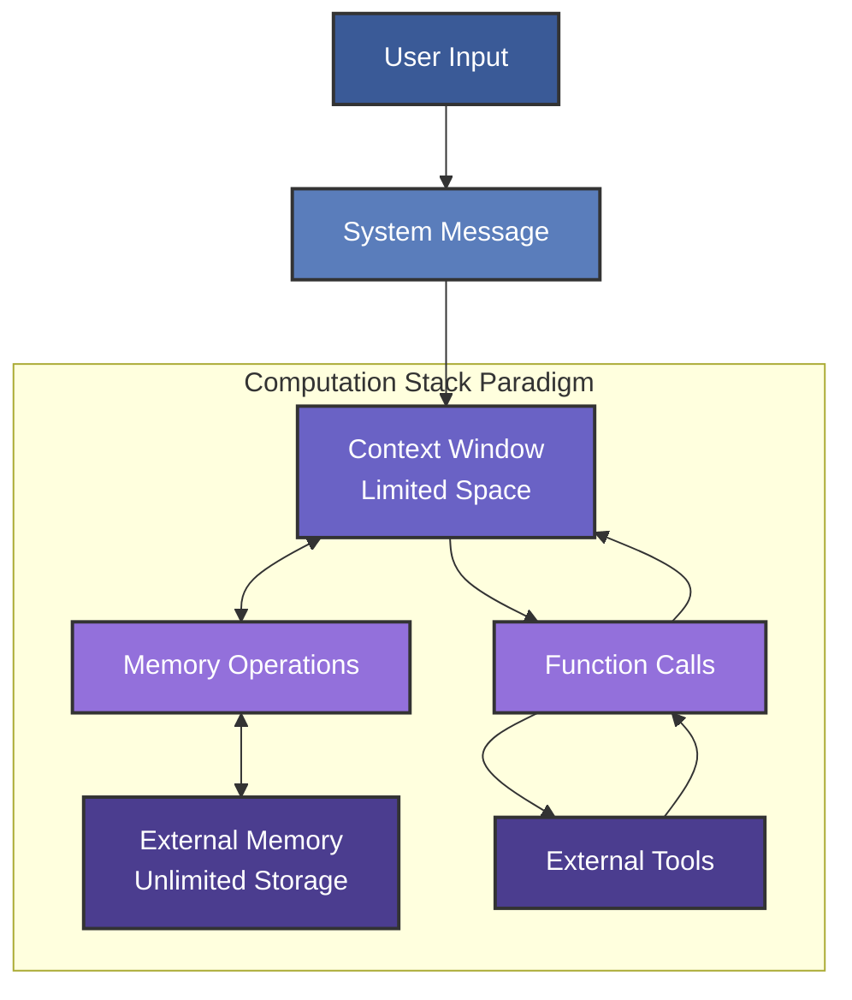
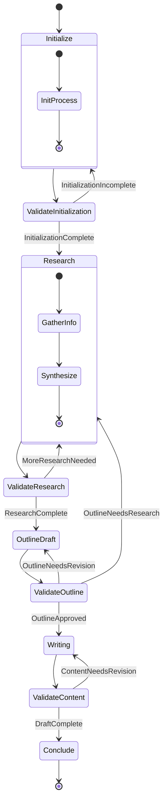

# Diagram Generation Guide

This guide provides instructions for generating the diagrams needed for the presentation.

## Option 1: Generate using Mermaid.js

You can use the Mermaid Live Editor (https://mermaid.live/) to generate SVG diagrams from the following specifications.

### 1. ERRV Pattern



Export as SVG and save as `errv.svg` in the images directory.

### 2. Primordial Loop



Export as SVG and save as `primordial_loop.svg` in the images directory.

### 3. MemGPT Architecture



Export as SVG and save as `memgpt.svg` in the images directory.

### 4. State Machine



Export as SVG and save as `state_machine.svg` in the images directory.

## Option 2: Use a Diagramming Tool

Alternatively, you can use diagramming tools like:

1. **Draw.io** (https://app.diagrams.net/)
2. **Lucidchart** (https://www.lucidchart.com/)
3. **Figma** (https://www.figma.com/)

Use the specifications in the `diagram_specs.md` file to create these diagrams.

## Converting SVG to PNG

If PNG files are preferred for the presentation, convert the SVG files using:

1. Online converters like https://svgtopng.com/
2. Command line tools:
   ```bash
   # Using ImageMagick
   convert errv.svg errv.png
   ```
3. Graphics software like Adobe Illustrator, Inkscape, or GIMP

## Updating Slide Links

After generating the diagrams, you may need to update the file paths in `slides/main.md` to point to either `.svg` or `.png` files, depending on which format you choose.