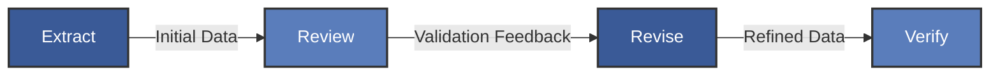
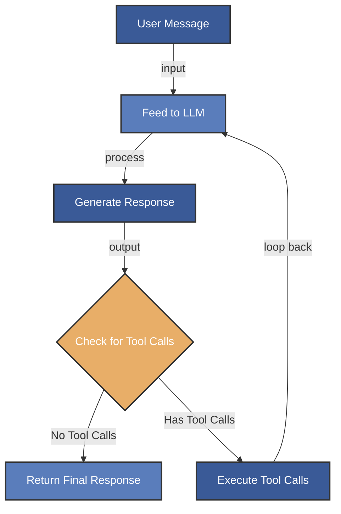
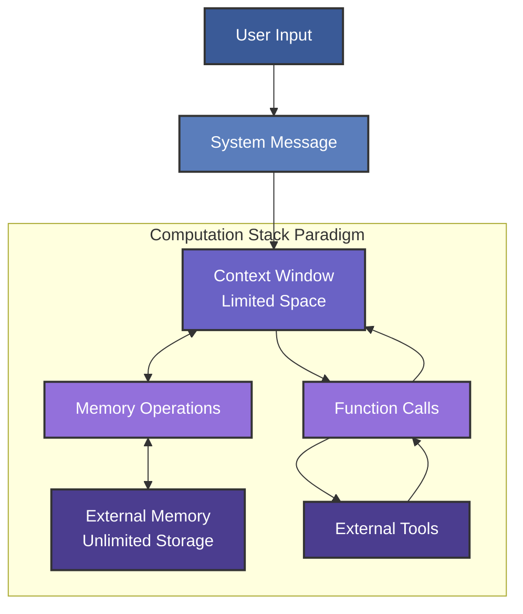
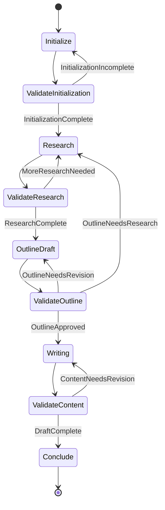

# SVG Diagram Reference

This file documents the SVG diagrams used in the presentation. All diagrams have been pre-generated as static SVG files and are displayed in the slides/main.md file.

## 1. ERRV Pattern

## 2. Primordial Loop

## 3. MemGPT Architecture

## 4. State Machine

## Mermaid Diagram Tips

1. **Colors**: Use the following colors to maintain consistency:
   - Primary boxes: `fill:#3a5a97,stroke:#333,stroke-width:2px,color:white`
   - Secondary boxes: `fill:#5a7dbb,stroke:#333,stroke-width:2px,color:white`
   - Highlight elements: `fill:#e8ae68,stroke:#333,stroke-width:2px,color:white`

2. **Text**: Keep text concise for better readability in presentation mode

3. **Complexity**: Limit diagram complexity to ensure it renders well in presentation mode

4. **Flow**: Use clear directional arrows with descriptive labels

5. **Testing**: Test diagrams in presentation mode to verify readability from a distance